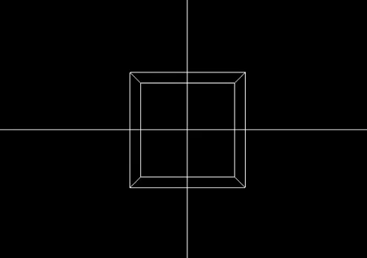

# Linear Transformation Simulation



- Linear Transformation Simulation on 2D and 3D plane using python OpenGL.
- Developed as part of IF2123 Geometry Algebraic course on Bandung Institute of Technology.
- Submitted on November 18th, 2018.

## How to Run:
Execute Main Program:
```python main/src/main.py```\
Also available 3D demo only:
```python demo/demo3d.py```\

**Running the Program:**
1. Open the terminal.
2. Navigate to the directory where the file is stored.
3. Run the file by typing `python3 main.py`.
4. After that, the user will be prompted to input:
   - Type 1 to enter the 3D window.
   - Type 2 to enter the 2D window.
5. Once the input is entered, the program will display a Pygame or PyOpenGL window.

**If the User Chooses 1 (3D):**
1. To enlarge the screen, press `Page Down`.
2. To reduce the screen size, press `Page Up`.
3. To adjust the viewing angle, use arrow keys (up, down, right, left).
4. To input a transformation function, press `F` while in the Pygame window.
5. Then type the function (e.g., `translate 3 3 3`).
6. To reset the object, type `reset`.

**If the User Chooses 2 (2D):**
1. To enlarge the screen, press the up arrow key.
2. To reduce the screen size, press `Page Up`.
3. To input a transformation function, press `F` while in the PyOpenGL window.
4. Then type the function (e.g., `translate 3 3`).
5. To reset the object, type `reset`.

## Available Transformation Function
| Command | Description |
|---------|-------------|
| `translate <dx> <dy>` | Translates the object by shifting the x-value by `dx` and the y-value by `dy`. |
| `dilate <k>` | Performs dilation on the object with a scaling factor of `k`. |
| `rotate <deg> <a> <b>` | Rotates the object counterclockwise by `deg` degrees around the point `a,b`. |
| `reflect <param>` | Performs reflection on the object. `param` can be one of the following values: `x`, `y`, `y=x`, `y=-x`, or `(a,b)`. The `(a,b)` value represents the point for reflection. |
| `shear <param> <k>` | Performs shear operation on the object. `param` can be `x` (along the x-axis) or `y` (along the y-axis). `k` is the shear factor. |
| `stretch <param> <k>` | Performs stretch operation on the object. `param` can be `x` (along the x-axis) or `y` (along the y-axis). `k` is the stretch factor. |
| `custom <a> <b> <c> <d>` | Performs a linear transformation on the object using the transformation matrix: `[[a b], [c d]]`. |
| `multiple <n>` | Performs linear transformation on the object `n` times sequentially. Each input line (1..n) can be `translate`, `rotate`, `shear`, etc., excluding `multiple`, `reset`, and `exit`. |
| `reset` | Resets the object to its initial state. |
| `exit` | Exits the program. |